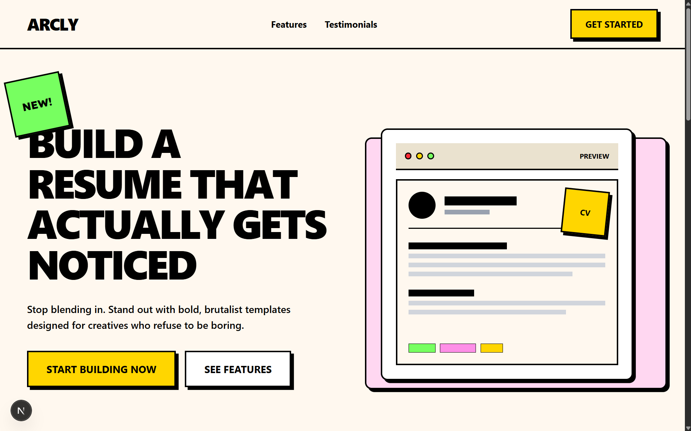
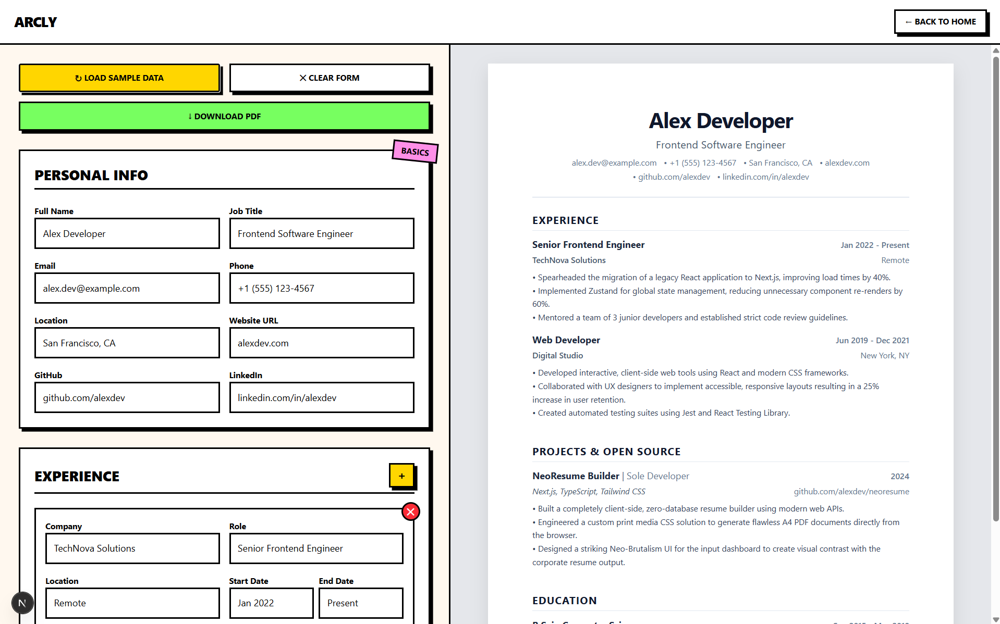

# ARCLY 

> **THE BOLDEST WAY TO BUILD A RESUME. ZERO SUBSCRIPTIONS. ZERO FRICTION.**

---

## EYE CANDY 

*(Drop your screenshots in the `public` folder and update these links!)*

> **The Front Door:** High-contrast, Neo-Brutalist marketing page built to grab attention.



> **The Engine:** Split-personality UI. Chaotic and creative on the left, strictly professional and ATS-compliant on the right.


---

## 💀 THE PROBLEM

Most online resume builders are traps. You spend 30 minutes typing out your entire professional history, tweaking the margins, and perfecting your bullet points—only to get hit with a hidden $5 paywall the second you click "Download PDF."

If they do let you download it, it's riddled with watermarks or uses absolute-positioned canvases that Applicant Tracking Systems (ATS) can't even read.

## 🚀 THE FIX

**ARCLY** is a 100% free, fully client-side resume builder built for developers and creatives.

* **Zero Accounts:** Jump straight in. No email verification required.
* **Zero Data Harvesting:** Everything you type is saved instantly and exclusively to your own browser's `localStorage`.
* **Zero Cost:** Native PDF generation means no expensive backend processing.

---

## 🎨 CORE FEATURES

* **Split-Personality Design:** An aggressive, visually distinct Neo-Brutalist editor workspace paired with a flawless, classic corporate PDF output.
* **Real-Time Preview:** Powered by Zustand, every single keystroke updates the live A4 preview sheet instantly without React re-render lag.
* **Auto-Save:** Close the tab? Refresh the page? Your data is exactly where you left it.
* **ATS-Optimized Export:** Uses standard, semantic HTML formatting inside a custom `@media print` query so automated resume scanners can read every word perfectly.
* **Sample Data Injection:** One-click dummy data loading to test layouts instantly.

---

## 🛠️ THE TECH STACK

| Technology | Purpose |
| --- | --- |
| **Next.js 16** | Core framework leveraging the App Router for a lightning-fast SPA layout. |
| **Tailwind CSS v4** | Heavy use of custom `@theme` variables for stark borders, hard shadows (`5px 5px 0px #000`), and fluid responsiveness. |
| **Zustand** | Bulletproof global state management with built-in `persist` middleware for seamless `localStorage` syncing. |
| **CSS Print Media** | Hijacks the browser's native `window.print()` to strip away the UI and generate pixel-perfect A4 documents. |
| **Vercel** | Edge-network deployment running cleanly on the ₹0 Hobby tier. |

---

## ⚙️ RUN IT LOCALLY

Want to spin this up on your own machine? It takes seconds.

**1. Clone the repository:**

```bash
git clone https://github.com/sadSanta-07/arcly
cd arcly

```

**2. Install dependencies:**

```bash
npm install

```

**3. Start the development engine:**

```bash
npm run dev

```

> Open `http://localhost:3000` and start building.

---

## 👤 DEVELOPER

Designed and engineered by **Sahil Singh** as a trial project for **Digital Heroes**.

* **Email:** sahilsingh107433@gmail.com
* **GitHub:** [github.com/sadSanta-07](https://github.com/sadSanta-07)
* **Deployed on:** [Vercel](https://arcly-resume.vercel.app/)